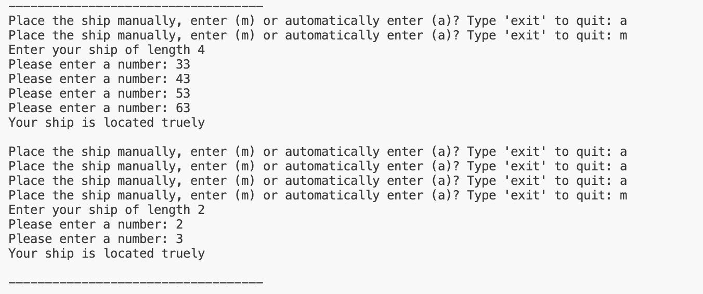

# The Battle of Ships

## [Link to Live Website](https://battleships-game-board-5c541f06f660.herokuapp.com/)

# Purpose 

"The Battle of Ships" is a digital version of the traditional Battleships game, where player can compete against an AI opponent. The game serves as an example of how to structure a game project in code, manage game state, and implement basic AI logic. It is also a great resource for those interested in learning about grid-based games, strategy development, and user interaction in software. 

- The game is built in Python as Milestone Project #3 for the Code Institute's Full Stack Software Development course.

-------

# User Experience (UX) and Design

## User Stories

- As a user, I want to understand the purpose and intention of the site and application when I run
  the program.
- As a user, I want the navigation to be intuitive and easy to understand.
- As a user, I want to be able to enter my name before I start to play the game.
- As a user, I would like to see a welcome message and my name added to the program for more engaging
  experience.
- As a user, I want my input to be validated and error checked each time, so I can re-enter my
  input/choice if it is invalid.
- As a user, I should not have to worry about capitalizing or lowercase when typing.
- As a user, I want to see the score after each turn.
- As a user, I want see the final result to see how many times I tried or computer tried to win the game.
- As a user, I want to have an opportunity to play again regardless of success or failure in the game.

## Design

### Data Model Overview

The Battleships game is built using an object-oriented approach, which organizes the game's logic into several classes: Ship, Board, and Game. Each class is designed to represent a specific aspect of the game, making the code modular, reusable, and easy to maintain.

### Key Classes and Attributes
#### 1. Ship
 - Purpose: The Ship class represents a ship in the game, including its size and current status.
##### Attributes:
 - size: The size of the ship, representing how many grid cells it occupies.
 - positions: A list of integers representing the ship's position on the grid. Each position corresponds to a cell number on the board.
##### Methods:
 - is_sunk(): Checks if the ship has been sunk, returning True if all positions have been hit (i.e., the list of positions is empty), otherwise False.

#### 2. Board
 - Purpose: The Board class represents the game board where ships are placed and where guesses (shots) are made.
##### Attributes:
 - taken_positions: A list of integers representing all the positions on the board that are occupied by ships.
 - ships: A list of Ship objects representing all the ships placed on the board.
 - hits: A list of integers representing the positions that have been hit by guesses.
 - misses: A list of integers representing the positions that have been guessed but did not hit a ship.
 - completions: A list of integers representing positions where ships have been completely sunk.
##### Methods:
 - check_ok(boat): Validates whether a ship's placement is valid, checking for overlaps, out-of-bound positions, and correct alignment.
 - add_ship(ship): Allows the player to manually add a ship to the board by specifying its positions.
 - auto_add_ship(ship): Automatically places a ship on the board by randomly selecting valid positions.
 - show_board(reveal_ships=False): Displays the board, showing hits, misses, and (optionally) the positions of ships.
 - check_shot(shot): Checks if a shot hits any ship on the board and updates the ship's status accordingly.

#### 3. Game
##### Purpose: 
 - The Game class manages the setup, progression, and conclusion of the game. It controls both the player’s and computer’s boards and tracks scores.
##### Attributes:
 - player_board: An instance of the Board class representing the player's board.
 - computer_board: An instance of the Board class representing the computer's board.
 - computer_board: An instance of the Board class representing the computer's board.
 - player_guesses: A list of integers representing the positions guessed by the player.
 - computer_guesses: A list of integers representing the positions guessed by the computer.
 - computer_tactics: A list of integers representing the computer's next strategic guesses based on previous hits.
 - player_score: An integer tracking the player's score (number of ships sunk).
 - computer_score: An integer tracking the computer's score (number of ships sunk).
##### Methods:
 - setup(): Sets up the game by placing ships on both the player's and computer's boards, either manually or automatically.
 - add_ship_for_player(ship): Prompts the player to place a ship either manually or automatically on their board.
 - show_game_boards(): Displays both the player's and computer's boards, hiding or revealing ships as appropriate.
 - get_shot(guesses): Prompts the player to input a valid guess (shot) and checks that it hasn't been guessed before.
 - computer_shot(): Generates a guess for the computer, using tactics if a previous shot hit a ship.
 - update_scores(hits, is_player): Updates the score for the player or computer based on whether a ship was hit.
 - play_turn(is_player): Executes a turn for either the player or the computer, checking for hits and updating the board.
 - calc_tactics(shot): Calculates the next set of potential shots for the computer based on the location of a previous hit.
 - check_win(board): Checks if all ships on a board have been sunk, indicating a win for the opponent.
 - ask_play_again(): Asks the player if they want to play another game after the current one ends.
 - start(): Starts the game, running through the setup and gameplay loop until a winner is determined or the player chooses to quit.

### Relationships Between Classes
##### Game: 
 - The central class that interacts with both the Player and Computer boards (Board instances) and coordinates the flow of the game.
##### Board:
 - Manages the layout of ships, tracks shots (hits and misses), and interacts with the Ship class to update ship statuses.
##### Ship:
 - Represents the individual ships on the board and tracks their status based on player and computer actions.

### Flowchart Overview

- The flowchart illustrates the logic and flow of the Battleships game, from the start of the game to its conclusion. The diagram is broken down into several key sections, each representing different stages of the game:

#### 1. Start and Setup:
 - The game begins with the display of instructions, followed by the prompt for the player to enter their name.
 - If the name is valid, the player moves on to ship placement. If the name is invalid, the player is asked to re-enter it.
#### 2. Ship Placement:
 - The player is given the option to place their ships either manually or automatically.
 - The computer places its ships automatically.
 - Both placements are validated to ensure they meet the game’s criteria (e.g., no overlap, valid coordinates).
#### 3. Gameplay:
 - Once ships are placed, the game enters the main gameplay loop where the player and the computer take turns shooting at each other's ships.
 - Each shot (user or computer) is validated to ensure it targets an unused coordinate on the board.
#### 4. Result Handling:
 - Shots result in either a hit or a miss. Hits are further checked to see if they result in the sinking of a ship (completion).
 - Scores are updated accordingly: a hit increases the score, while a miss does not.
#### 5. Endgame:
 - The game checks if all ships have been sunk (after 6 ships are sunk), which determines the winner.
 - The player is then given the option to either play again or exit the game.

### Flowchart Analysis
##### Decision Points:
 - The flowchart includes multiple decision points (e.g., checking the validity of a name, ship placement, and shot accuracy), ensuring that the game progresses correctly.
##### Loops: 
 - The gameplay loop repeats until a winner is determined, reflecting the turn-based nature of the Battleships game.
##### Outcomes: 
 - The game concludes with either a win for the player or the computer, after which the player can choose to restart or exit.

# Features

## Existing Features

###  1. Welcome Screen and Game Instructions
 - Introduction: When the game starts, players are greeted with a welcome message and provided with detailed instructions on how to play the game. This includes an explanation of the board layout, how to place ships, and the rules for taking shots.
 - Name Entry: Players are prompted to enter their name, which is validated to ensure it's alphabetic. This personalizes the game experience.

### 2.  Ship Placement
 - Manual Ship Placement: Players can choose to manually place their ships on the board by entering specific coordinates. This feature allows for strategic placement, giving the player control over their setup.
 - Automatic Ship Placement: For quicker gameplay or less experienced players, the game offers an option to automatically place ships. This feature randomly generates valid positions for ships, ensuring a valid and fair layout.

### 3. Player vs. Computer Gameplay
 - Turn-Based System: The game operates on a turn-based system where the player and the computer take alternate turns to shoot at each other's ships. The player’s board and the computer’s board are updated after each shot to reflect hits, misses, and ship completions.
 - Shooting Validation: Both player and computer shots are validated to ensure they are within bounds and not repeated. This ensures fair gameplay and prevents errors.
 - Computer Tactics: The computer employs a basic strategy (tactics) to make its shots more effective, especially after a hit. This adds a layer of challenge for the player.

### 4. Board display
 - Board Display: The game board is displayed after each turn, showing the status of hits, misses, and ship placements (for the player's board). The computer's board only reveals the outcome of shots without showing ship positions until they are hit.
 - Symbols:
 - " _ " represents an unexplored coordinate.
 - " X " indicates a hit.
 - " o " represents a miss.
 - " @ " shows a ship's position (on the player's board only, when revealed).
 - " S " indicates a ship has been completely sunk.

### 5. Scoring System
 - Hit and Miss Tracking: The game keeps track of successful hits and missed shots for both the player and the computer. The player’s score is incremented for each successful hit.
 - Completion Check: After each hit, the game checks whether a ship has been fully sunk, and if all ships are sunk, the game declares a winner.

### 6. Game End and Replay
 - Win Condition: The game ends when one player sinks all of the opponent's ships. A message is displayed declaring the winner, either the player or the computer.
 - Play Again Option: After the game ends, the player is given the option to play again or exit the game. This feature allows for continuous play without restarting the program.

### 7.  User-Friendly Error Handling
 - Input Validation: Throughout the game, inputs are validated to prevent errors. For example, the game checks for valid coordinates during ship placement and shot selection. If an invalid input is detected, the player is prompted to re-enter their choice.
 - Graceful Exits: Players can exit the game at any point during the ship placement phase if they choose not to continue.

### 8.  Randomized Gameplay Elements
 - Ship Placement and Shot Selection: The computer's ship placement and shot selection are randomized, ensuring that each game is unique and unpredictable. This randomness makes the game more challenging and replayable.

### 9. Modular Code Design
 - Object-Oriented Approach: The game is designed using an object-oriented approach, making it modular and easier to maintain or expand. Key components like Ship, Board, and Game are encapsulated within their respective classes.

## Testing

- Note: This game will not work on mobiles as it runs on the mock terminal. (credit: Mock terminal created by Code Institute). No accessibilty or responsivity testing was therefore needed.

### Validator Testing

 - Python code is tested using Code Institute PYTHON LINTER, with no errors. Code passed through and  
   confirmed no problems.  

  - validated run.py file:
     
     

### Manual Testing:

- I tested the site in my local terminal and Code Institute Heroku Terminal.
- For user testing, I passed the application link to my friends and family and received positive 
  feedback.

- Input Validation:

The application is tested extensively for input validation. I have manually tested it by doing 
following:

1. Proceed further with input incorrect character/number for "Enter your name" propmt.
     
    - Response: Receive an error message and prompt "Invalid data entered, please enter your name".

    
    

2. Input ship placement option with numbers or out of option characters or proceed without entering one. 
  
    - Response: An Error: " Invalid data entered.please try again " comes up.

    

3. Input, incorrect and invalid coordinates to place the ships manualy.

    - Response: Error message is displayed for the numbers greater than 99 and smaller than 0 : "Error: Enter a number between 0-99.. Please enter a valid number."
    - Error message is displayed for character or letter input: "Error: invalid literal for int() with base 10: 'g'. Please enter a valid number.

            

4. Input, incorrect and invalid coordinates to guess or shot the computer's ships. 

    - Response: Receive an error message and prompt for entering the number out of range: Invalid input data entered or used number entered.
    - response: Receive an error message and prompt for entering a letter: Please enter a valid number 0-99.

    

### Functional Testing:

Functional testing for user stories is as follows:

1. Expected: As a user, I want to understand the purpose and intention of the site and application  
   when I run the program.
    - Result: When user clicks on run program, an instructions will display with
              general idea and rules.

2. Expected: As a user, I want the navigation to be intuitive and easy to understand.
    - Result: The user is provided with easy to understand options and choices to navigate throughout
              the game.

4. Expected: As a user, I want to be able to enter my name before I start to play the game.
             I would like to see a welcome message and my name added for more engaging
             experience.
    - Result: User is prompted to enter name which is further used in welcome message for personalized experience.

5. Expected: As a user, I want my input to be validated and error checked each time, so I can 
             re-enter my input/choice if it is invalid.
    - Result: Input validation is carried out at each step where user input is required and error 
              message is displayed if it is invalid prompting user to re-enter the input/choice.

6. Expected: As a user, I want to see the score after each turn.
    - Result: User will see the score after each guess.

7. Expected: As a user, I want see the final result to see how many times I tried or computer tried to win the game.
    - Result: At the end of the game, the user is given an option to play again, based on user choices,
              the game exits or start from beginning.

## Tools and Technologies

- [Python](https://www.python.org/) - used to develop the project (back end programming).
- [GitHub](https://github.com/) - to host the source code online.
- GitPod - IDE to develop the website.
- Git to provide the version control to commit and push code to the repository.
- [Am I Responsive](http://amiresponsive.blogspot.com/) to create the Mockup image in this README.
- [Heroku](https://www.heroku.com/) - to deploy the app.
- Code Institute [PYTHON LINTER](https://pep8ci.herokuapp.com/#) used to validate the python code for
  errors.
- [lucichart.com](https://www.lucidchart.com/pages/?) - to create flowchart for the project.
- Code Institute's Template to generate the workspace for the project.

## Imports
 - random
 - randrange

## Version Control

The site is developed through GitPod IDE.

- Git

  Code has been pushed to repository on Github with following git commands:

    - git add . - to add files ready to commit
    - git commit -m "message" - to commit the code to local repository ready to be pushed
    - git push - final command used to push committed code to remote repo on Github

## Cloning the Repository

1. On Github navigate to the repository "https://github.com/Naviid24/pp3-battleships"
2. Click "Code" drop down menu - a green button shown right above the file list.
3. Copy the URL of the repository using "HTTPS", "SSH" or "Github CLI".
4. Open Git Bash.
5. Change the current working directory to the location where you want the cloned directory.
6. Type "git clone", and then paste the URL copied earlier.
7. Press enter to create local clone. A clone of the repository will now be created.

- For more details on how to clone the repository in order to create a copy for own use refer to the 
  site: <https://docs.github.com/en/repositories/creating-and-managing-repositories/cloning-a-repository>

## Forking

1. On Github navigate to the repository "https://github.com/Naviid24/pp3-battleships"
2. Click "Fork" located towards top right corner on GitHub page.
3. Select "owner" for the forked repository from the dropdown menu under "owner".
4. It will create forked repo under the same name as original by default. 
   But you can type a name in "Repository name" or add a description in "Description" box.
5. Click on "Create fork". A forked repo is created.

- Forking allows you to make any changes without affecting original project. You can send the
  the suggestions by submitting a pull request. Then the Project Owner can review the pull request before accepting the suggestions and merging them.
- When you have fork to a repository, you don't have access to files locally on your device, for 
  getting access you will need to clone the forked repository.
- For more details on how to fork the repo, in order to for example suggest any changes to the 
  project you can visit:<https://docs.github.com/en/get-started/quickstart/fork-a-repo>

## Deployment

- The web application is displayed and deployed using template provided by Code Institute to test the
  code.

- The project is deployed on Heroku as follows:
1. Use: pip freeze > requirements.txt to add external libraries to deployed app.
2. Create Heroku account
3. In the top right, click 'New'
4. Click 'Create new app'
5. Give your app a name and select your region from drop down
6. Click 'Create new app'
7. Go to 'settings' tab, it's important you do it before deployment
8. Scroll down to 'config vars' section and key: PORT and value: 8000
9. Scroll down to 'Buildpacks' section
10. Click 'Add buildpack'
11. Add Python as first dependency and select 'Save changes'
12. Add node.js as a second dependency and save again (This is settings section done)
13. Select 'Deploy' tab at the top
14. Select 'Github' from 'Deployment method'
15. Type the name given to your project in Github and click 'search'
16. Scroll down and select Manual deployment method
17. You can also use Auto deployment method to allow the project to update every time you push the
    code.  
18. You can now click to view the app ready and running.

- For this project I used Manual deployment method to deploy the current state of the branch, every
  time I pushed the code from Codeanywhere.

# Credits

- Use the Code Institute videoes
- Watch videos on Youtube:
  - "https://www.youtube.com/watch?v=tF1WRCrd_HQ"
  - "https://www.youtube.com/watch?v=Ej7I8BPw7Gk&list=PLpeS0xTwoWAsn3SwQbSsOZ26pqZ-0CG6i"

